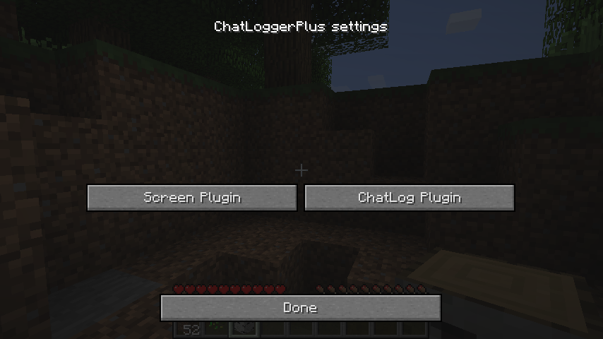
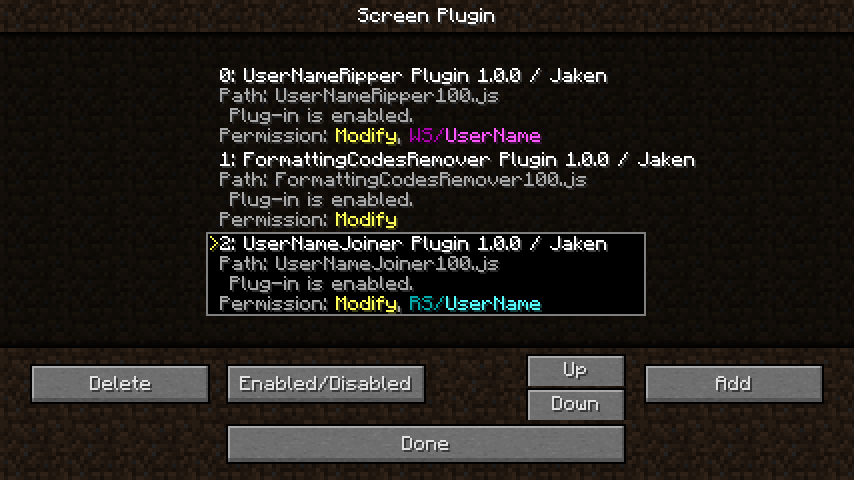
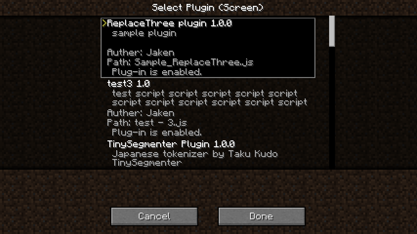

.. _use_plugin:

プラグインを使う
##################################################

プラグインとは？
**************************************************
一般的な用語と同じように、ここでは「 **ChatLoggerPlusに備わっていない機能を、後から付け足せる物** 」のことを「プラグイン」と呼びます。
このプラグインは、テキストファイルに記述されたスクリプトを解釈することで実現しています。

ただし、スクリプトを記述するには、プログラミングの知識が必要になってしまいます。
そこで、プラグインを「部品」のように扱えるようにし、一般ユーザーは、出来るだけ「 **プラグインを選択して組み合わせるだけで、求めている機能を実現できる** 」ようにしています。

.. note::
    プラグインの設定変更のために、スクリプトを修正しなければならないケースもあります。

    ですが「設定を変更されることを前提に作られているプラグイン」であれば、その範囲内の修正は、それほど難しくは無いはずです。（簡単に変更が出来るように作り手側が考えてます）
    configファイルを編集できるスキルがあれば、そのようなプラグインの設定変更も簡単に出来るでしょう。

プラグインについて
**************************************************
まずは、概要でもお見せした図を確認ください。

.. image:: https://cacoo.com/diagrams/92t1GUWyAXoBK8zC-7B345.png

このように、ChatLoggerPlusは「 **受信したチャットのメッセージ** 」に対して処理を行います。

この部分だけを抽出した図が次の図です。

.. image:: https://cacoo.com/diagrams/sk2EfTc5RQIsJGIg-7B345.png

至ってシンプルな図になりました。

そして、これに「ChatLoggerPlusがプラグインを含めて行う動作」を図に書き足したものが次の図です。

.. image:: https://cacoo.com/diagrams/FWTghiZjygNOxlhq-7B345.png

このように、ChatLoggerPlusでは、チャットメッセージを２つのものに分けて考えます。

 * 画面に出力されるチャット文字（Screen Plugin）
 * ログ保存ファイルに出力されるチャット文字（ChatLog Plugin）

プラグインは発言単位でチャット文字列を受け取り、文字のチェックや加工、削除、その他の動作が行えます。
そして、ChatLoggerPlusは、これらのチャット文字を「プラグイン」に受け渡し、結果を順次処理をさせ、すべてのプラグインで処理した結果を画面及びログファイルに出力します。

これは、画面用の加工と、ログ保存用の加工が、別々で行えるということです。

このように、チャットの文字加工を、対象別に分けることによって、「画面表示では特定の文字を伏字にして、チャットログにはオリジナルのメッセージを出力する」といった使い分けが可能になります。

ユーザーは、「 " **どこを対象** " に " **どのプラグイン** " を " **どのような順番** " で適用するか」だけを意識すれば、使うことができます。

事前準備
**************************************************

プラグイン機能を有効にする
==================================================
ChatLoggerPlusのデフォルトの設定では、プラグイン機能は無効になっています。
このため、プラグインを使えるようにするためには、この機能を有効にしなければなりません。

configフォルダにある、「com.tojc.minecraft.mod.ChatLoggerPlus.cfg」ファイルをテキストエディタ等で編集する必要があります。

以下のPluginScriptsEnabledをtrueに設定してください::

    general {
        B:PluginScriptsEnabled=true
        （・・・省略・・・）
    }

これでプラグイン機能が有効になります。
設定に関する詳細は :ref:`setting_config` を参照ください。

.. attention::
    プラグイン機能を有効にすると、「フォーマットコードの塗りつぶし処理」は行われなくなります。
    同様の処理はFormattingCodesRemoverプラグインを使うと実現できます。FormattingCodesRemoverプラグインについては :ref:`formatting_codes_remover` を参照してください。

プラグインを準備する
==================================================
デフォルト設定では、configフォルダの中にChatLoggerPlusPluginsフォルダが出来ていますので、そのフォルダの中に、ダウンロードしたプラグインを配置します。

配布されているプラグインの拡張子は、ほとんどが「js」となっているハズですので、そのファイルを入れてください。
（プラグインの拡張子が「js」でない場合は、別途スクリプトの設定などが必要になる場合があります）
また、このChatLoggerPlusPluginsフォルダに入れただけではプラグインは有効になりません。後述の処理登録作業がゲーム内で必要です。

.. tip::
    このChatLoggerPlusPluginsフォルダのサブフォルダの中にプラグインがあっても認識します。
    （ただし、zip形式などで圧縮されている場合は読み込めませんので、必ず展開して入れてください）

.. note::
    プラグインの読み込みは、現在はワールドログイン時のみです。そのうち、再読み込みボタンをどこかに用意したいと思ってます。

.. caution::
    「このChatLoggerPlusPluginsフォルダに入れただけではプラグインは有効になりません」と書きましたが、スクリプトのプログラムの一部はMinecraft起動時に読み込まれ実行されます。
    悪意のあるプラグインの場合、Minecraftとは全く別の処理を行える可能性があるので、 **利用するプラグインの配布元** を意識してください。
    出来るだけ、フォーラムのChatLoggerPlusトピックに話題が上がっているものを使うようにすると、安全だと思います。

設定画面の呼び出しとキー設定の変更
**************************************************
それでは、Minecraftのゲーム画面を起動してください。設定するために、まずはローカルサーバにログインしましょう。（特に問題が無ければマルチサーバでもOKです）

初期状態では、プラグインは一つも処理を行うようには登録されていません。

デフォルトでは、Lキーに設定画面を割り当ててありますので、設定画面を開いてみましょう。このような画面が出ます。

ここでは、Screen PluginかChatLog Pluginのどちらの処理順序を編集するかを選びます。

.. tip::
    設定画面の呼び出しキーは、Minecraftのオプション画面からキー設定を開くと、別のキーに割り当てることができます。
    また、この呼び出しキーは、 **PluginScriptsEnabledがtrueの場合のみ有効** になります。

プラグインの処理登録と順序
**************************************************
ここでは、Screen Pluginの設定画面を開きました。このスクリーンショットでは、既にいくつか登録済みの状態です。

この中央のリストに表示されているものが「処理が行われるプラグイン」です。発言ごとに、このリストの **上から順番に下へ向かって** 処理が行われます。

ここでは以下のような操作が可能です。

 * Addでリストにプラグインを追加できます。
 * Deleteで画面のリストからプラグインを削除できます。（プラグインのファイル自身には影響ありません）
 * Enabled/Disabledで有効無効の切り替えができます。（ただし、エラーで無効になっているものは有効化できません）
 * UP,Downで選択中のプラグインを移動させ、並び替えを変更できます。

それでは、Addボタンで以下のようなプラグイン選択画面が開きますので、どれか一つを選択してください。
ここには、ChatLoggerPlusPluginsフォルダへ配置されたプラグインが全て表示されます。

パーミッション（権限）について
**************************************************
プラグインは、「ある一定の機能」を使うためには、それを使うことを宣言しなければならないようにしています。
宣言したパーミッションは、プラグイン一覧画面にて、ユーザーに通知されます。
これは、利用者がプラグインの中身を把握できなくても「ああ、このプラグインはチャット文字を加工するんだな」とザックリと理解できるように用意しています。

パーミッション（権限）には、以下のような種類が存在しています。

.. csv-table:: パーミッション（権限）一覧
    :header: "表示名", "概要", "詳細"
    :widths: 10, 20, 70

    "Modify", "チャット加工有り", "このプラグインはチャットの文字を加工（変更・削除）します。"
    "Add", "チャット追加メッセージ有り", "このプラグインは発言の後に、追加のチャット文字を出力します。※これを実現するためにチャットメッセージを横取りする必要があるので、Addパーミッションが必要なプラグインは他のチャット処理MODと競合する可能性があります。"
    "WS/xxxx", "スタック書き込み有り", "このプラグインは、他のプラグインと連携するために、スタックに情報を新規作成し書き込みます。"
    "RS/xxxx", "スタック読み込み有り", "このプラグインは、他のプラグインと連携するための既存のスタックの情報を読み書きします。"

例えば、特定の文字を塗りつぶすプラグインがあった場合、このプラグインはチャットを加工する必要があるので、必ずModifyパーミッションを持っています。
逆に、Modifyパーミッションを持っていないプラグインは、チャットの文字を変更することは出来ません。

スタック関連パーミッションのxxxxには、プラグインが使用するキーワードが表示されます。このキーワードが同じものが、連携するプラグインとなります。
これは、ほとんどのケースで、WSパーミッションを持つプラグインとRSパーミッションを持つプラグインが、同じキーワードで「対」になります。

.. important::
    RSパーミッションのプラグインの **前** に、必ず **同じキーワードのWSパーミッションのプラグイン** が存在しなければなりません。

スタックについて
**************************************************
ある情報を記録して一時的に貯めておく場所のことを「スタック」と呼んでいます。
どのような情報を記録して受け渡しするかは、プラグインが自由に決めることができます。

例えば

 #. チャット文字をチェックし、スタックにフラグを立てるプラグイン
 #. スタックのフラグをチェックし、そのフラグを元に動作するプラグイン

のように、スタックは **プラグイン同士で連携** するために使われます。

プラグイン利用者は、どのような情報が受け渡しされるのかは、基本的に意識する必要はありません。
その代り、RSパーミッションのプラグインの **前** に、必ず **同じキーワードのWSパーミッションのプラグイン** が存在しなければならないため、関連するプラグインの「並び順」だけは気を付けてください。

この順番が守られていない場合、画面上でエラーメッセージが表示されます。

